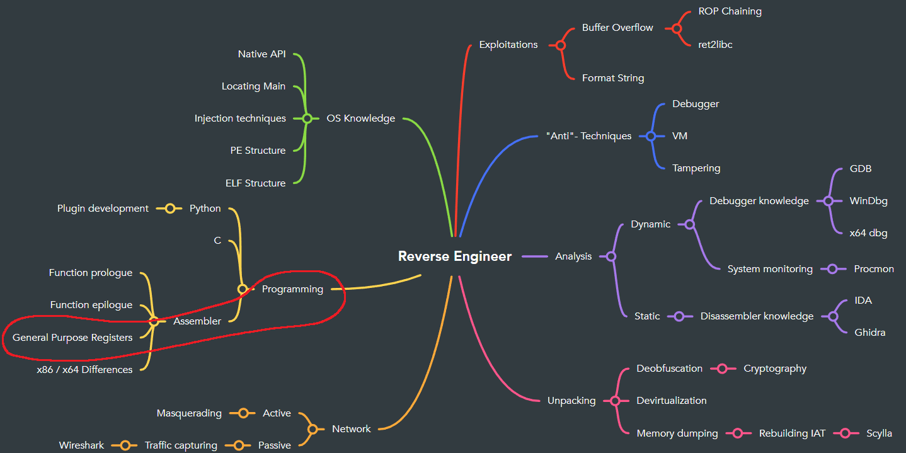

# Assembly Refresher

When reverse engineering, you most likely have to read through a lot of assembly code. Since you don't really need assembly elsewhere nowdays, you might have forgotton some things of what you've learned until now.

# Goals
 - Refresh your knowledge about the General-Purpose Registers
 - Write a simple program in asm

# Task
Please read through the steps and follow along