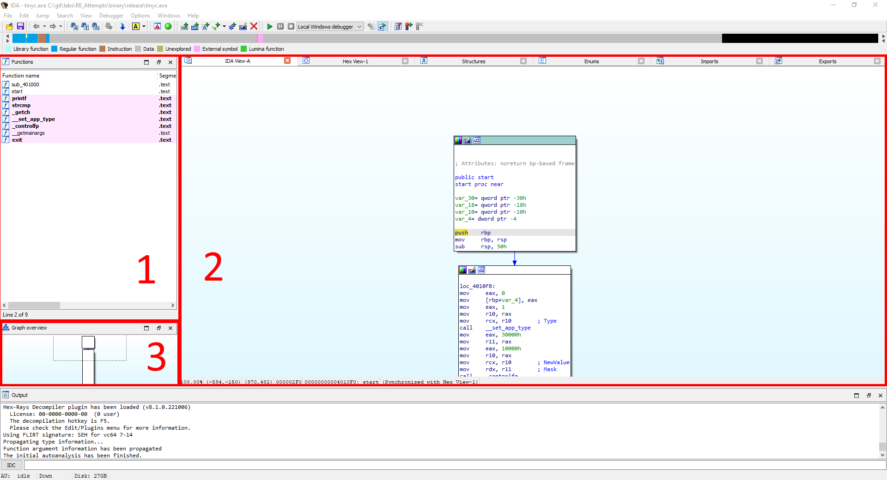

# Windows

After you open a binary to analyze you will see the following windows:

Section 1: This part lists all function which got identified by IDA. You can select a function here to open it in the main window (2).

Section 2: This part of the program is where you will spend probably the most time statically reverse engineering. It shows the assembly code of the currently selected function.

Section 3: Here you can see the whole calling tree of the function and it helps to navigate with bigger binaries. It's basically a zoomed out version of Window 2.
