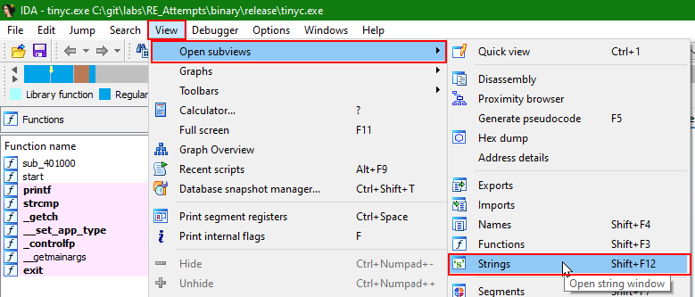

# Menu
At the top of the program you will find the menu bar you know. The most important function up here is to open the window which will display you all of the strings the disassembler identified:

