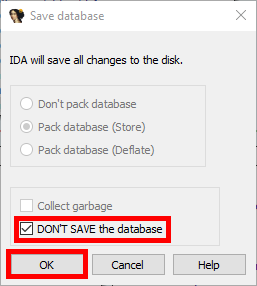

# Exiting the program
After analysing a program you want to the exit the program. You will see the following window:

Here you can select OK to save your IDA Session or use the Checkbox "DON'T SAVE" to not save the IDA Session.