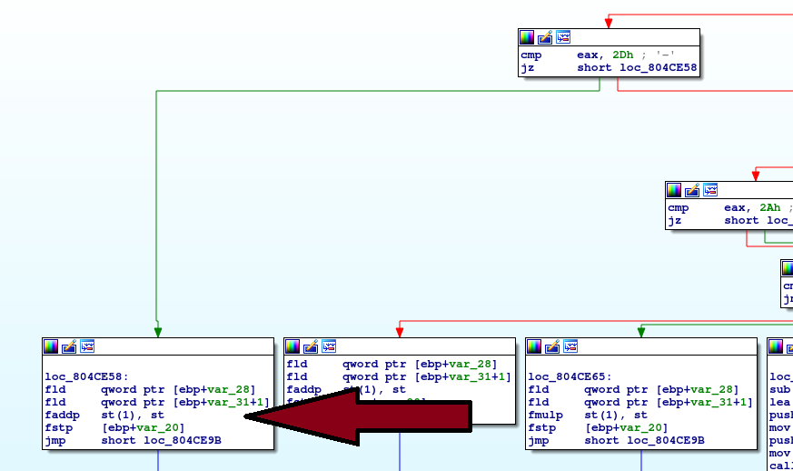
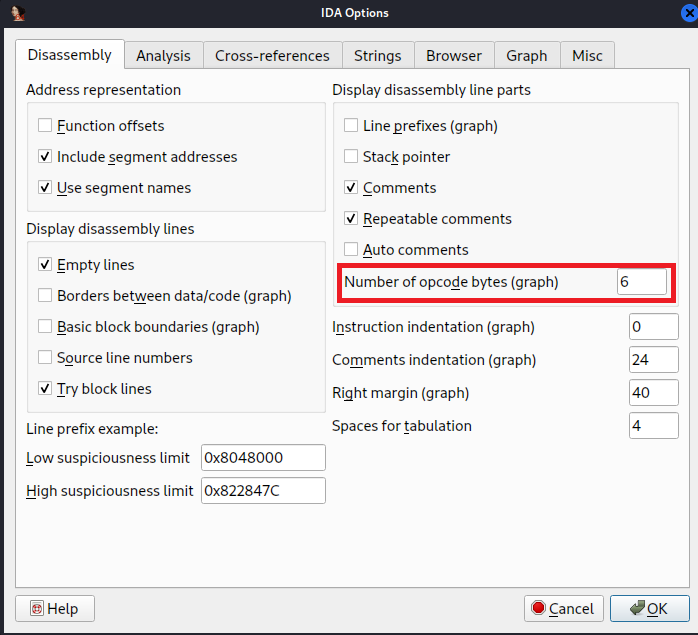
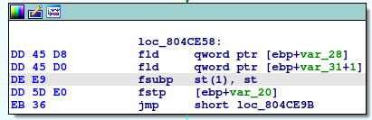

# Static analysis
After you have found the bug in the executable, try to also find it in IDA.
- Open up ```calculator``` in IDA (ignore all warnings) and wait until the initial analysis has finished
- Navigate through the main function until you encounter the section with the bug
- In here you find an ```faddp``` instruction when someone wants to perform a subtraction.
  
	
- When looking at the [documentation](https://c9x.me/x86/html/file_module_x86_id_81.html) you see that this is most likely a c&p fault of the developer of the binary who forgot to adjust his code for subtraction.
- Since you want the binary to actually subtract at this point, you have to look for a suiting assembly instruction like [fsubp](https://c9x.me/x86/html/file_module_x86_id_121.html)
- To successfully patch this binary, you have to know and therefore see the opcodes of the instructions. To view opcodes in IDA, click on the ```Options``` dropdown and choose ```General...```. In there, change the `Number of opcode bytes (graph)` to 6: 

	
- You should now see the opcodes next to the assembly instructions.
- Looking at the documentations of ```faddp``` and ```fsubp```, you can see that in this implementation only differ in 1 byte: 
	
	| Instruction 	| Opcode    	|
	|-------------	|-----------	|
	| faddp       	| 0xDE 0xC1 	|
	| fsubp       	| 0xDE 0xE9 	|
- Now that you know what to patch and where to apply it, highlight the faddp instruction and go to ```Edit -> Patch program -> Change byte...```. This opens up the Patch Bytes window in where you can see the next 16 bytes, starting at your highlighted instruction. You are only interested in the first 2 bytes (```DE C1```), since they are responsible for the ```faddp``` instruction. Replace the ```C1``` with ```E9``` and click on OK.
- If done everything correctly, the ```faddp``` instruction should now have changed into ```fsubp```:

	
- The last step is to apply these changes to the binary. In order to do this, go to the drop down menu and select ```Edit -> Patch program -> Apply patches to input file...```. Select ```Create Backup``` and click on OK to successfully save your patched binary.