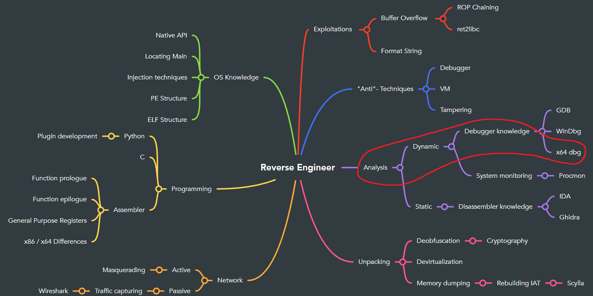

# Introduction x64dbg

x64dbg is a widely used open source x64 / x32 debugger for windows.

# Goals
- Install and setup x64dbg
- Find out how to use x64dbg

# Task
Please read through the following steps.