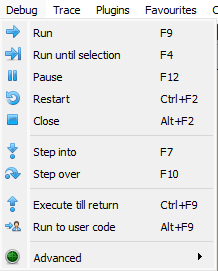

# Menu - Dropdowns
At the very top of the program you can see the menu dropdown:


For this course the ```Debug``` dropdown is the only really relevant for solving the exercises. In there you can see the debugger operations like ```Run```, ```Pause```, ```Step Into``` and ```Step over```:



If you want to customize appearance or hotkeys, have a look at the ```Options``` dropdown.