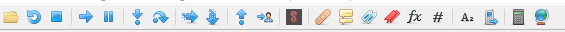

# Menu Buttons
Right below the dropdown menu you can see the menu buttons:



The following enumeration refers to the menu buttons from left to right:

| Name					| Function                                                                                                
|-----------------------|-----------------------------------------------------------------------------------------------------
| Open File 			| Open an executable
| Restart   			| Restarts the currently loaded binary (If no binary is loaded, it starts the one you debugged at last
| Close     			| Closes the currently opened binary
| Run 					| Continues the execution of the program
| Pause					| Pauses the execution of the program
| Step Into				| Steps into the function the EIP is currently pointing at
| Step Over 			| Steps over the function the EIP is currently pointing at
| Trace Into			| Lets you examine the details of each instruction stepped into when stepping manually
| Trance Over 			| Lets you examine the details of each instruction stepped over when stepping manually
| Execute till return 	| Continues the execution of the program until the next ```ret``` instruction

The remaining buttons are not needed for now.