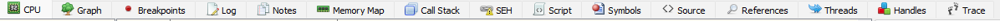

# Menu Tabs
The tabs menu is located below the menu buttons:



The most important tab is ```CPU``` which is selected by default. In there you can see all the assembly code and also navigate around with the help of the other menus.

The next and last tab you may need for now is ```Breakpoints``` in order to see all the breakpoints you've set while debugging.
