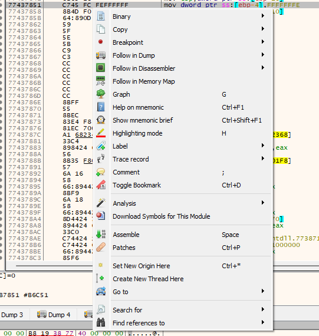

# Context Menu (CPU)
The context menu appears when you right click any instruction on the CPU tab:



The following table explains the most important entries:

| Name                   | Function  
|------------------------| ------------------------------------------------------------------------------------------------------------------|
| Breakpoint             | Sets a breakpoint on the highlighted instruction
| Follow in Dump         | Follows the instruction in one of the 5 ```Dump windows``` at the bottom (the ```Dump windows``` display the memory location of the address).
| Follow in Dissasembler | Follows the instruction in the ```CPU``` window. This can be used for following calls or jumps.
| Comment                | Allows to put a comment next to the assembly instruction for better overview.
| Set New Origin Here    | Puts the EIP to the highlighted instruction 
| Go to 				 | Allows you to jump to locations at the binary like ```Origin``` (EIP), any ```Expression``` and many more.
| Search for 			 | Allows searching for ```Strings```, ```GUIDS``` and much more across the binary.