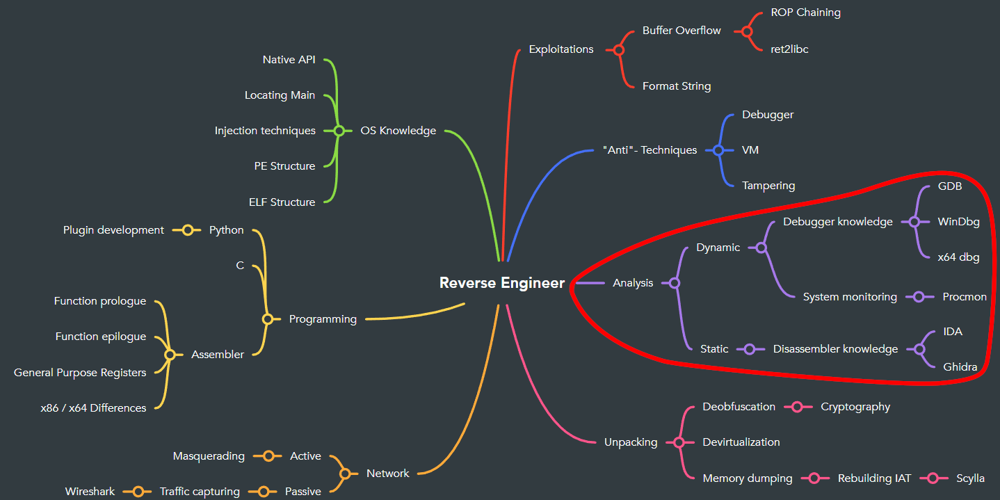

## Introduction
These are the first real challenges you have to solve yourself. 
   

## Prerequisits
You should have solved the introduction series and understand each step of them.

## Goal
You will be able to reverse engineer binaries with the tools you learned in the introduction series.

## Download Resources

[C++](../../binary/release/cplus.exe)

[TinyC](../../binary/release/tinyc.exe)

