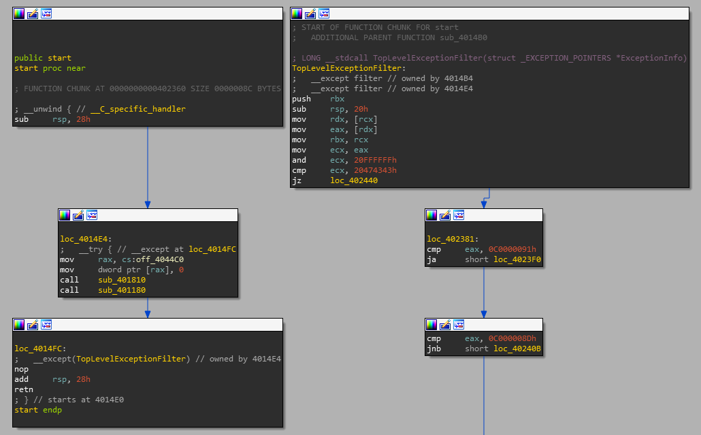
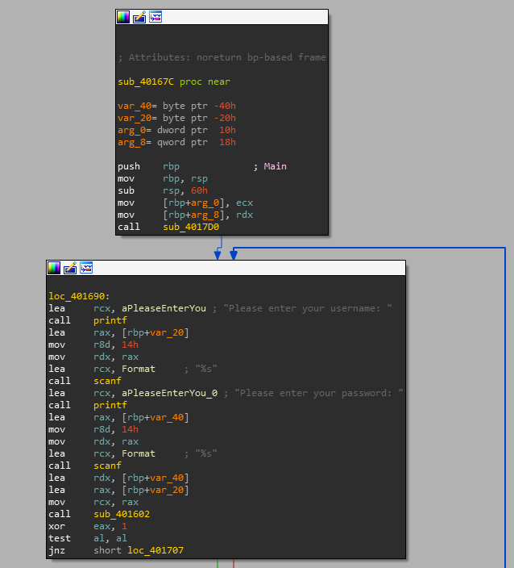
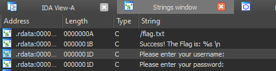
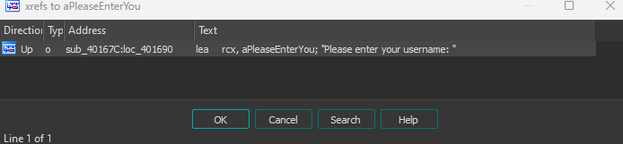

# Find Main
When opening the binary in IDA, you'll see a screen like this after it has finished analyzing:
   

1. Follow the second call ```sub_401180``` by double clicking.
2. Follow the function flow until the very bottom. There you should find another call to the function ```sub_40167C```.
3. Now you should see the main function. You can verify it by looking at familiar strings like "Please enter your username:":

   

Alternatevly you can also look for strings in the binary by hovering over the ```View``` -> ```Open Subviews``` -> ```Strings``` tab at the top of the program, or by pressing Shift + F12.
   

   Double clicking "Please enter your username:" will bring you into the location of the string in the ```string table```. You may now highlight the string and either press hotkey ```X``` or right click and select ```Jump to xref to operand...``` in order to get a list of locations that reference this string.
   

   Double click the displayed location and you'll be brought to the main function.