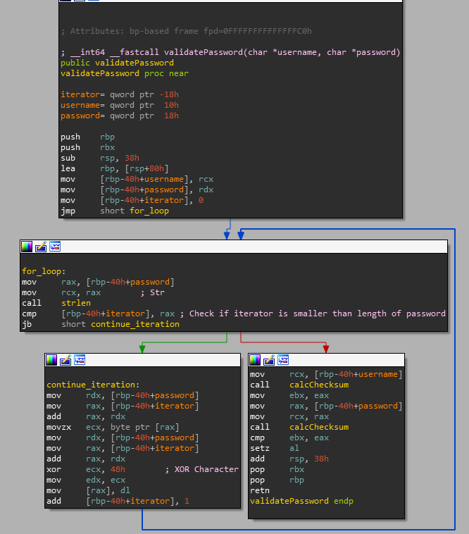

# Validate Password
The first call after the second scanf in the main function is responsible for the password validation. Here is a screenshot of the function with the most important operations labeled:
