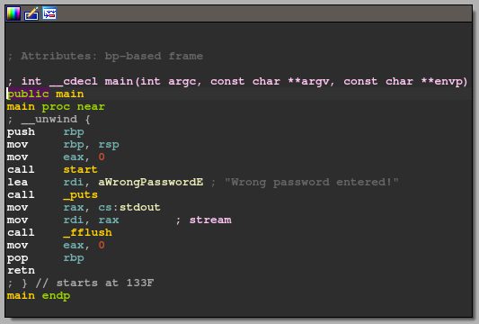
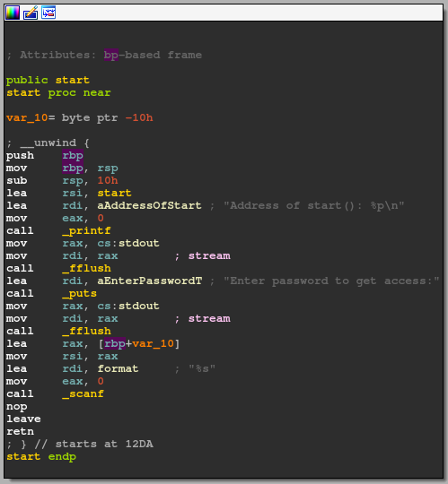
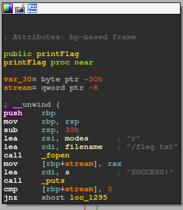
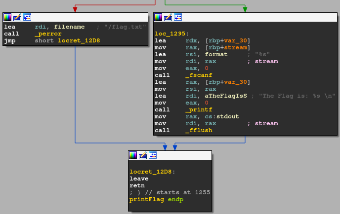

# Find a way to exploit the program
Connect to localhost and download the binary to inspect it. \
When you open the binary in IDA and wait for the initial analyzation youll see the main function displayed, which you can verify by checking for familiar strings ("Wrong password entered"):



Checking out the function shows you that it calls both ```start``` and ```_puts```. 

Following the ```start``` function leads you to the next part with the vulnerability:



Try to find the vulnerability yourself with a hint: **Overflow** \
The next step will explain it if you struggle to find it yourself.

When you check the function names you will see a function named "printFlag".



Hovering over the function name and pressing CTRL + X to get a list of all the functions referencing it shows you that it has none. You can compare to other outputs by trying the command on the other functions. 

Follwing the Jump instructions shows that it prints the content of a file (flag.txt) when no error occurs. 



This indicates that an overflow has to be exploited to get to the correct address and execute the function.


