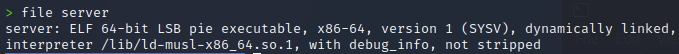

# Find the buffersize
## Vulnerability
You can skip ahead to "Installing pwntools" if you found the vulnerability yourself. 

The vulnerable function which is exploitable is: ```scanf()```. The function has a predefined size buffer and using ```%s``` to read the input doesn't check the length of the inputted string. If the user enters a string longer which would exceed the buffer size it would overflow and allows to reach addresses which weren't meant to be reached. 

## Installing pwntools
Follow the instruction on in the [documentation](https://docs.pwntools.com/en/stable/install.html) of pwntools to install it on your VM. To use the Command-Line Tools of pwntools you have to add it to the PATH which is done by opening ```.zshrc``` (file from which interactive shells read commands) in /\<user> and add "export PATH="/home/\<user>/.local/bin:$PATH" at the end. Restart your terminal. Then check if your Command-Line Tools work by entering ```pwn``` in your terminal. 

## Preparation
First we inspect the file with:
```sh
file <filename>
```


This command shows what type of ELF it is (in this case a 64 Bit binary) and which interpreter it needs to run (musl). This can be installed by entering:
```sh
sudo apt-get install musl
```
Now youre ready to exploit!

## Find the buffersize
Finding the buffersize can be done by bruteforcing it with string which is increased each iteration. Pwntools has some tools to make it more interesting. Check out the [documentation](https://docs.pwntools.com/en/stable/commandline.html) for an overview of Command-Line Tools.

Start by generating a string using ```pwn cyclic 30```. This returns you a the first 30 characters of a predefined string. This is useful for finding out the buffer size since a certain response can be looked up.

echo the string into the binary with ```echo "<cyclic_string>" | ./<file_name>```.

You will get a Segmentation Fault which you can check with ```sudo dmesg | tail``` (Prints the tail of the message buffer of the kernel). You will see a message similar to "segfault at --XXXX". 

Cyclic can only interpret 32 Bit input which is why you take the last 4 Bytes shown. 

Enter ```pwn cyclic -l 0x<XXXX>``` into your terminal to get the buffer size (should be 24). This command looks up the value you gave it in the predefined string. 

To confirm the size you can use python:
```sh
python -c "print('A'*<buffersize>+'CAFEFE')" | ./server
``` 
Reading the kernel messages again shows you that the program tried to reach the address "FEFEAC", confirming the buffersize.


