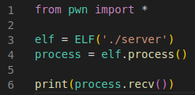
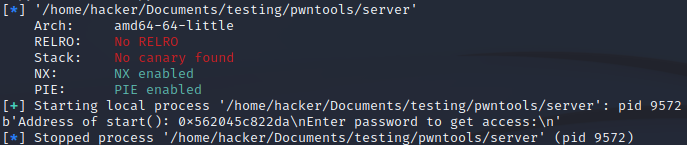

# Checksec
Start by importing everything from ```pwn```. To begin the script type the following:



This will expose functionalities to manipulate the ELF file and start a process with it. Finally it prints out the first chunk of strings received. 



Running the script will print a "checksec"-output before starting the process and returning the printed content.

# Checksec
Checksec is one of the multiple Command-Line Tools pwntools offers. It can be run by itself or is executed when starting a pwn script. 

For this lab we focus on the "PIE: PIE enabled" output. 

Position Independent Executables (PIE) are an output of the package build process. A PIE binary and all of its dependencies are loaded into random locations within virtual memory each time the application is executed. 

To help with this randomness the program prints out the address of "start" when run. 


