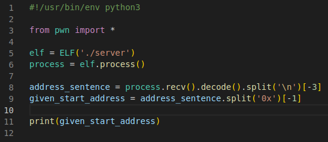

# Find out the Address of printFlag
First you need to extract the address of the start function using the python script. You can code it yourself or copy the reference below:



You should now have the address printed out on each execution of the script. 

This is just the address of the start function from which the address of the getFlag function can be calculated. 

## Calculate the Address
Since its a PIE the starting address is random but the offsets are constant. You can find them by running the "readelf -s \<binary>" This returns the offsets of each function to the starting address:


The idea is to find the address of the printFlag() function using the given address of the start() function. 

```
start: 0x00000000000012da
printFlag: 0x0000000000001255
main: 0x000000000000133f
```
Since the binary has PIE enabled it uses a random base address with the above shown offsets to reach each function. 
```
address_of_start = random_start + 0x12da
address_of_printFlag = random_start + 0x1255
address_of_start = <given>
```
The binary shows the current function of start() on each iteration which means subtracting the offset from it results in the base address (same with the printFlag() function).
```
random_start = address_of_start - 0x12da
random_start = address_of_printFlag - 0x1255
```
Now its just a matter of substitution.
```
<given> - 0x12da = address_of_printFlag - 0x1255

address_of_printFlag = <given> - 0x12da + 0x1255
```
This shows that its just a matter of first subtracting the offset from the given address to get to the base address and then adding the offset of the printFlag() function to it to get the address of printFlag(). 