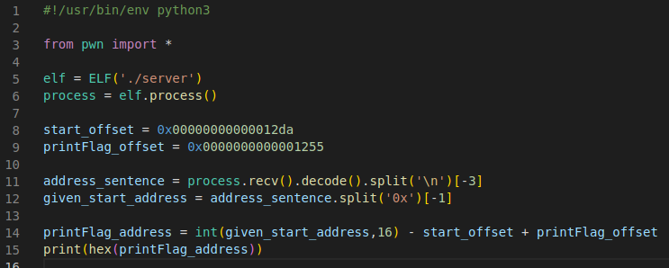

# Send Payload with PWN script
To add and subtract the hexvalues from the start address you first have to tell python to make it a base 16 int. 

Next we generate the payload for the script. We found out the buffersize in Step 2 and now have to append the printFlag address to it and send it to the program. 

The PWN library allows to generate a 64 bit output from the calculated int and pass it into the payload.  

To see what the programm receives you have to make it interactive by adding "process.interactive()"

Running the finished programm should show the "SUCCESS!" message.

## Remote
The message shows that the script is working and reaches the printFlag() function. Now, make it connect to the remote docker instance which is running by modifing the code:

The only thing that needs to be changed is the process variable. Now instead of a local file the script has to make a remote connection to the docker IP address on port 1345. For this, instead of running the process as an elf instance, remote is used.

Run the script again and receive the flag. 