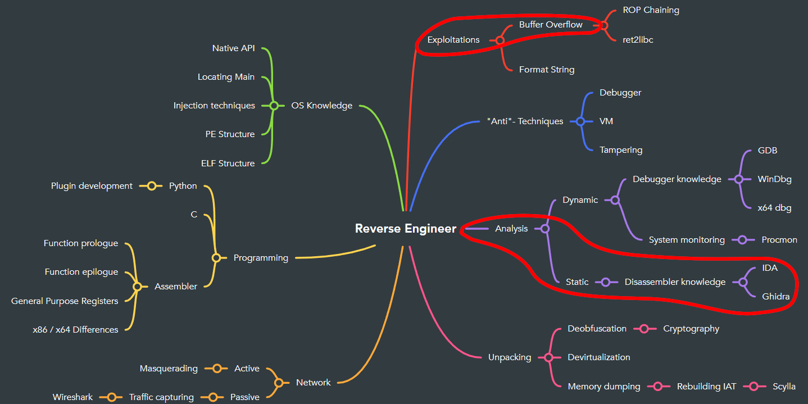

# Introduction


```pwntools``` is a framework and exploit development library. Written in Python, it is designed for rapid prototyping and development, and intended to make exploit writing as simple as possible.
You will learn how to use the tools it provides to exploit a program and find the hidden flag. \
Start the service from ```RESOURCES```. The docker is offering two ports (web and socket port). 
- port 80
- port 1342

Try to find a way to exploit port 1345 using ```pwntools```.

# Artifacts
* please download the server binary from the vulnerable service on port `80`

# Goals
- Find the weakness of the running programm
- Exploit it using pwntools