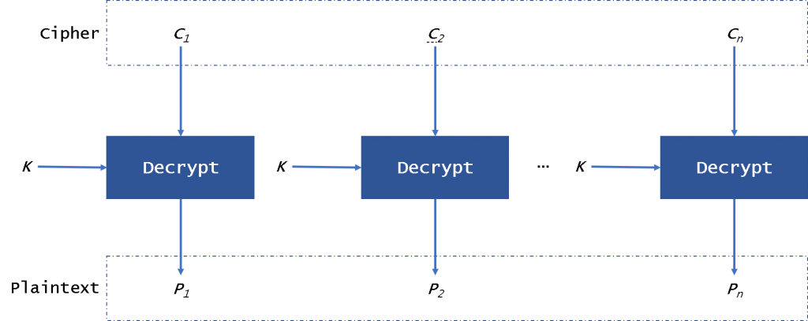

# AES Explanation
There are five different AES modes:
- ECB mode: Electronic Code Book mode
- CBC mode: Cipher Block Chaining mode
- CFB mode: Cipher FeedBack mode
- OFB mode: Output FeedBack mode
- CTR mode: Counter mode

In this lab we will focus on the first one (ECB). This block cipher is limited by design to accept only a certain length of blocks to encrypt data. AES then encrypts every block of data seperatly and appends it to the resulting ciphertext. \
ECB doenst differ from that. How it works is, it encrypts every block in isolation where other modes perform encryption between the blocks aswell. This method makes that the same input always results in the same output. In detail, it encrypts every block of data with the same key and appends it to the ciphertext (see the image below).
