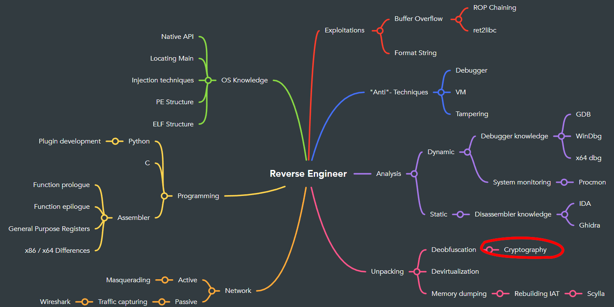

# Introduction


Encryption is used everywhere to ensure the safety of data and information but encryptions have weaknesses which can be exploited. In this lab we will take a look at a certain mode of the AES encryption, how it works and how to find out the key to its secret.
Start the service from ```RESOURCES```. The docker is offering two ports (web and socket port).
- port 80
- port 1345 (connect with netcat)
Find the flag by getting the key of the encryption.

# Artifacts
* please have a look the python file from the vulnerable service on port `80`

# Goal
- Understand the weakness of AES ECB
- Find the flag using pwntools

