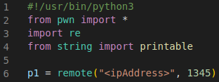
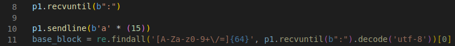
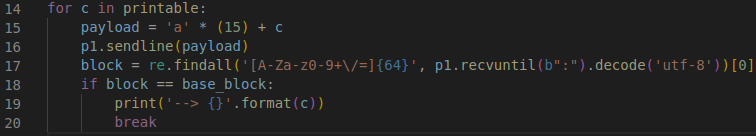

# Get the Key - Write Script to get first letter (Example)
**Connect to the port**\
As done in previous labs the connection to the port works as follows:

**Send a 15 byte message and save the output**\
The Regex saves the first 64 chars of the output which consist (as we know) of the flag, the 15 characters sent and the 1 character from the key. 

**Compare to all printable characters**\
Python can use "printable" to iterate over all possible values. As explained in Step 2 each character has to be tested until the output matches the reference (block == base_block). 

Running this script gives the first value of the key. Now its just a matter of looping it. Try it yourself or check out the example in the next step. 

"log.info()" or "print()" can be used to see output while the script is running. You can also add DEBUG to the command (python script.py DEBUG).