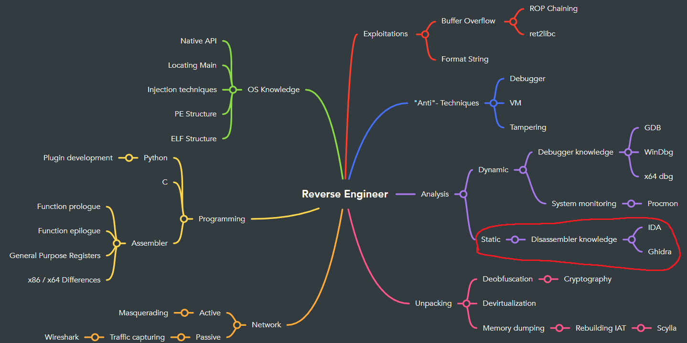

## Introduction
This part will focus on the **static** part of the analysis.
   

## Prerequisits
You need to have need a disassembler installed. For this exercise we focus on IDA.
(If not done already, please revisit introduction #1.)

## Goal
Being able to statically reverse engineer a simple binary and find the main function.