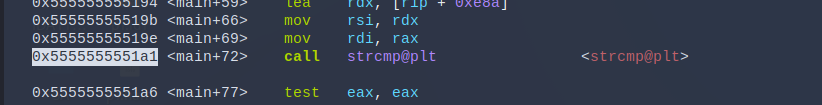
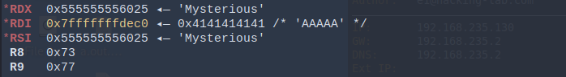

## Step 1 - GDB
As a first step, we analyze the same binary from the previous excercise - but dynamically.

(Download pwndbg extension for GDB https://github.com/pwndbg/pwndbg)

1. Open up a terminal at the same location you have the binary file from the previous excercise stored. 
2. Type gdb "NAME_OF_FILE"
3. Set a breakpoint on main using: <code>break *main</code> and run the program using <code>run</code>
4. Step through the executable using: <code>si</code> for "step into" or <code>ni</code> for "next instruction" 
5. Stepping through the debugger you'll find <code>printf</code>, <code>scanf</code> and <code>strcmp</code> calls. Step through the code until you reach a <code>strcmp</code> call. You can also set a breakpoint on the address where strcmp gets called: 
   
   
   In this case the command would be <code>break *0x5555555551a1</code>. And to continue execution, you may enter: <code>c</code>.
6. The execution of the program now stopped at the <code>strcmp</code> call. Analyzing the assembly code, you can see that the two arguments needed for <code>strcmp</code> were moved into the registers rsi and rdi. Have a look at the registers now:

	
	
	Et voilà! The RDI register holds your input while RSI has the key it compares against (in this case, our flag).