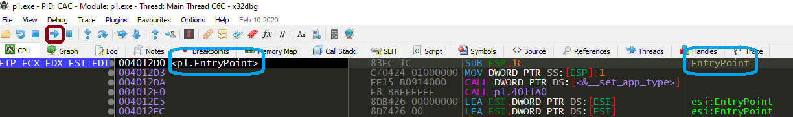
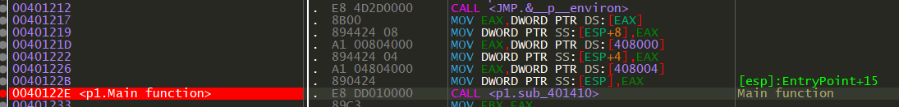
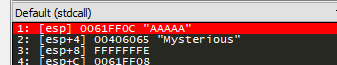

## Step 1 - x64dbg
As a first step, we analyze the same binary from the previous excercise - but dynamically.
1. Open up your installation folder of x64dbg
2. Drag and drop "NAME_OF_EXE" onto x32dbg.exe located in "x64dbg\release\x32\"
3. Press run (marked with red) until you reach the entry point (marked with blue).
   
4. The first call is to initialize the stack security cookie. This is a security measure automatically implemented from windows, you can ignore this.
5. Press F10 until the EIP is at the second call instruction (here at address 0x004012E0).
6. Press F7 to step into the function.
7. When scrolling down, you can find the characteristic pattern of calling the main function, which takes three 3 arguments:   
8. You now see several strings you also encounter when launching the application. There are also functions you already know like: <code>printf</code>, <code>scanf</code> and <code>strcmp</code>. Place a breakpoint onto the <code>strcmp</code> function (F2) and run the binary.
9. You now have to enter a password into the console window of the binary. Once you've done that, you may notice that the debugger ran into the breakpoint and paused execution.
10. We know that <code>strcmp</code> takes 2 arguments. In the assembly you see that before the function call, two variables get moved onto the stack. Those two are our input and the secret key it gets compared against. Have a look at the righthand side of the x32dbg window: 

	
	
	Et voilà! Just below my input "AAAAA", you can see the string it compares against (in this case, our flag).