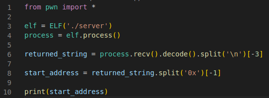
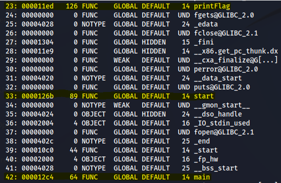

# Find out the Address of printFlag
First you need to extract the address of the start function using the python script. You can code it yourself or copy the reference below:



You should now have the address printed out on each execution of the script. 

This is just the address of the start function from which the address of the getFlag function can be calculated. 

## Calculate the Address
Since its a PIE the starting address is random but the offsets are constant. You can find them by running the "readelf -s \<binary>" This returns the offsets of each function to the starting address:



These offsets can be used to caculate the address to get to printFlag from start: 

```
start: 0x0000126b
printFlag: 0x000011ed
main: 0x000012c4

address_of_start = random_start + 0x0000126b
address_of_printFlag = random_start + 0x000011ed
address_of_start = <given>

random_start = address_of_start - 0x0000126b
random_start = address_of_printFlag - 0x000011ed

<given> - 0x0000126b = address_of_printFlag - 0x000011ed

address_of_printFlag = <given> - 0x0000126b + 0x000011ed

address_of_printFlag = <given> - 126
```