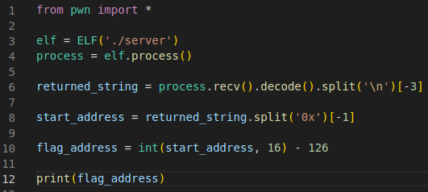
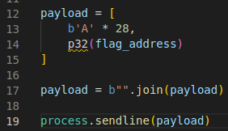

# Send Payload with PWN script
To subtract the calculated value from the start address you first have to tell python to make it an int. 

Next we generate the payload for the script. We found out the buffersize in Step 2 and now have to append the printFlag address to it and send it to the program. 

The PWN library allows to generate a 32 bit output from the calculated int and pass it into the payload.  

To see what the programm receives you have to make it interactive by adding "process.interactive()"

Running the finished programm now gives you the desired flag. 