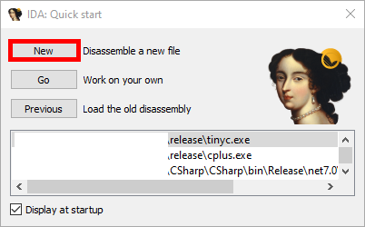
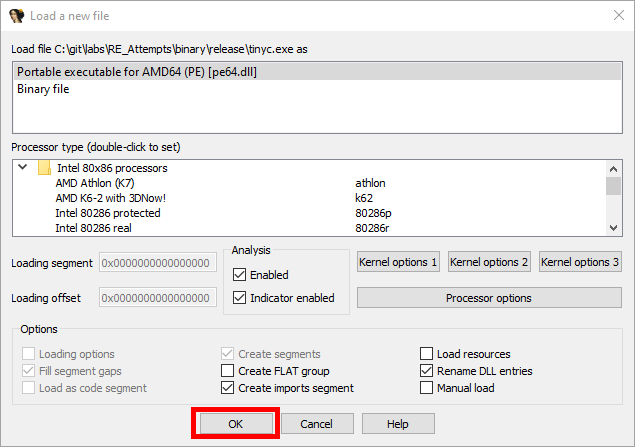

# Startup
After booting up the program you will see a window which will explain the restrictions of the free version. Either confirm with OK or it will close itself after some seconds.

Then the following prompt will open:

Here you can press new to open a file dialog where you can choose the binary (.exe) you want to analyze. This will open the next window:

Here you could set how IDA should analyze the file. But this is out of scope for our lab so you can always confirm this window with OK.