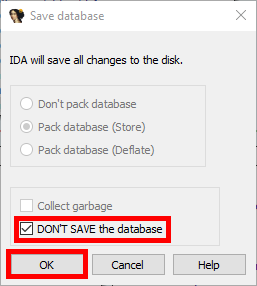

# Exiting the program
After analysing a program you want to the exit the program. You will see the following window:

Here you can select the checkbox to not save your IDA Session and keep the folder with the binary tidy. Confirm with OK.
