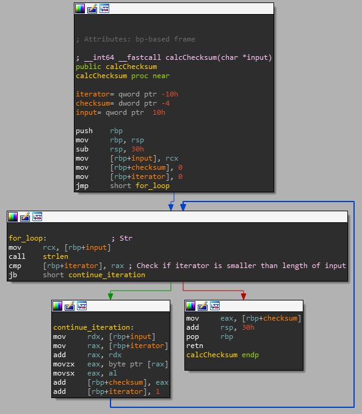

# Calc Checksum
The calcChecksum function can be found inside the password validation function. It's called twice: once with username and once with password as parameter. Here is a screenshot of the function with the most important operations labeled:

   
